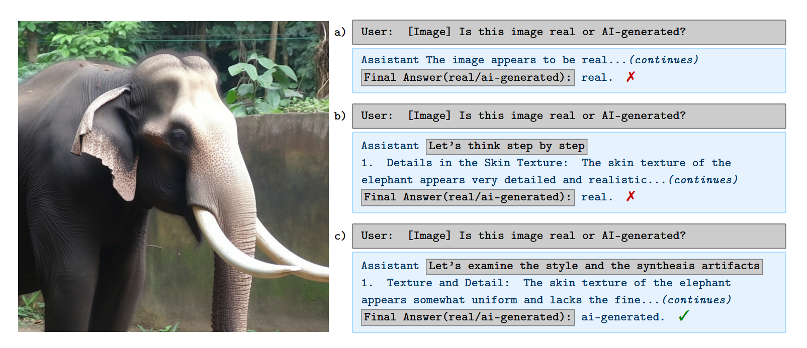

# Zero-shot-s2: Task-aligned prompting improves zero-shot detection of AI-generated images by Vision-Language Models

## Overview

As image generators produce increasingly realistic images, concerns about potential misuse continue to grow. Traditional supervised detection methods rely on large, curated datasets and can struggle to generalize across diverse image generators. This repository accompanies the paper investigating the use of pre-trained Vision-Language Models (VLMs) for the zero-shot detection of AI-generated images.

While off-the-shelf VLMs exhibit some task-specific reasoning capabilities, and chain-of-thought prompting offers performance gains, we demonstrate that task-aligned prompting elicits more focused reasoning and significantly improves detection performance without requiring any model fine-tuning.

**The Core Method: `zero-shot-s²`**

The central method introduced in our work is `zero-shot-s²` (zero-shot style and synthesis).

> [!IMPORTANT]
> * **To apply our primary method for detecting AI-generated images:** This involves programmatically inserting the phrase **“Let’s examine the style and the synthesis artifacts”** as a prefix into the VLM's *assistant* response field, guiding its generation process. This is the core of the `zero-shot-s²` technique. (The prompting logic, including this insertion, is managed by the `get_model_guiding_prefix_for_mode` function within `utils/helpers.py` in our experimental scripts). If your goal is to quickly leverage this core technique with a compatible open-source VLM, this is the main takeaway.
>
> * **To reproduce the full experimental results from our paper or to build extensively upon this work:** You will need to follow the detailed setup, data preparation (including downloading and organizing datasets), and experimental procedures outlined in the subsequent sections of this README.

### Applying the `zero-shot-s²` Prompt (Conceptual Example)



Our study shows that the `zero-shot-s²` approach boosts Macro F1 scores by 8%–29% for two widely used open-source models. These gains are consistent across three recent, diverse datasets spanning human faces, objects, and animals, with images generated by 16 different models—demonstrating strong generalization.

We further evaluate the approach across three additional model sizes and observe improvements in most dataset–model combinations, suggesting robustness to model scale. Surprisingly, self-consistency—a behavior previously observed in language reasoning where aggregating answers from diverse reasoning paths improves performance—also holds in this visual reasoning setting. Even here, `zero-shot-s²` scales better with self-consistency than chain-of-thought in most cases, indicating that it elicits more useful diversity.

Our findings show that task-aligned prompts elicit more focused reasoning and enhance latent capabilities in VLMs, like the detection of AI-generated images—offering a simple, generalizable, and explainable alternative to supervised methods. This repository provides the code and experimental results to support these findings.

## Table of Contents

- [Repository Structure](#repository-structure)
- [Prerequisites](#prerequisites)
- [Setup](#setup)
  - [1. Clone the Repository](#1-clone-the-repository)
  - [2. Create a Virtual Environment](#2-create-a-virtual-environment)
  - [3. Install Dependencies](#3-install-dependencies)
  - [4. Data Preparation](#4-data-preparation)
- [Configuration](#configuration)
- [Usage](#usage)
  - [Running Experiments](#running-experiments)
    - [Example: Evaluating Qwen2.5 7B on GenImage (2k sample)](#example-evaluating-qwen25-7b-on-genimage-2k-sample)
    - [Example: Evaluating CoDE model on GenImage (2k sample)](#example-evaluating-code-model-on-genimage-2k-sample)
  - [Generating Result Tables and Plots](#generating-result-tables-and-plots)
    - [Example: Generating the Scaling Consistency Plot](#example-generating-the-scaling-consistency-plot)
  - [Downloading and Preprocessing D3 Dataset Images](#downloading-and-preprocessing-d3-dataset-images)
- [Expected Outputs](#expected-outputs)
- [Troubleshooting](#troubleshooting)
- [License](#license)
- [Citation](#citation)
- [Contributing](#contributing)
- [Acknowledgements](#acknowledgements)
- [Changelog](#changelog)

## Repository Structure

```
Zero-shot-s2/
├── config.py            # Central configuration for paths and global parameters
├── data/                # Placeholder for input datasets (managed via .gitignore)
│   ├── d3/              # D3 dataset images and metadata CSV
│   ├── df40/            # DF40 dataset CSVs and image subfolders
│   └── genimage/        # GenImage dataset CSVs and image subfolders
├── experiments/         # Scripts for running evaluations and data processing
│   ├── evaluate_AI_llama.py
│   ├── evaluate_AI_qwen.py
│   ├── evaluate_CoDE.py
│   └── load_d3.py
├── outputs/             # Default location for generated results, plots, tables
│   ├── responses/       # Raw model responses and rationales (JSONL)
│   ├── scores/          # Evaluation scores (JSON, CSV)
│   ├── plots/           # Generated plots (PNG, PDF)
│   └── tables/          # Generated LaTeX tables (.tex)
├── results/             # Scripts for generating tables and plots from experiment outputs
│   ├── combine_tables.py
│   ├── distinct_words.py
│   ├── find_images.py
│   ├── macro_f1_bars.py
│   ├── model_size_table.py
│   ├── prompt_table.py
│   ├── recall_subsets_table.py
│   └── scaling_consistency.py
├── utils/               # Utility scripts and shared helper functions
│   └── helpers.py       # Core helper functions for data loading, evaluation, etc.
├── .gitignore           # Specifies intentionally untracked files (e.g., large data files)
├── LICENSE.md           # Project license
├── README.md            # This file
└── requirements.txt     # Python dependencies (for remaining packages after manual install of torch/flash-attn)
```

## Prerequisites

* Python (e.g., 3.10+ recommended)
* `pip` (Python package installer)
* (Optional) Conda for environment management
* (Optional but Recommended for speed) NVIDIA GPU with CUDA installed for model inference. This setup targets CUDA 12.6.

## Setup

### 1. Clone the Repository

```bash
git clone https://github.com/Zoher15/Zero-shot-s2.git # Assuming this is the correct URL
cd Zero-shot-s2
```


### 2. Create a Virtual Environment

It is highly recommended to use a virtual environment to manage dependencies.

**Using `conda` (Recommended for this project):**
```bash
conda create -n zeroshot_s2 python=3.10 -y
conda activate zeroshot_s2
```
(Note: The original README mentioned python=3.10.14; using python=3.10 is generally sufficient.)

**Using `venv`:**
```bash
python -m venv venv
source venv/bin/activate  # On Windows use: venv\Scripts\activate
```


### 3. Install Dependencies

Due to the specific requirements of PyTorch with CUDA and `flash-attn`, dependencies must be installed in a particular order:

**a. Install PyTorch, Torchvision, and Torchaudio:**
These packages need to be installed explicitly with CUDA 12.6 support from the specified PyTorch index.
```bash
pip install --no-cache-dir "torch==2.7.0+cu126" "torchvision==0.22.0+cu126" "torchaudio==2.7.0+cu126" --extra-index-url https://download.pytorch.org/whl/test/cu126
```

**b. Verify PyTorch Installation:**
After the previous step completes, verify that PyTorch is installed correctly and can access CUDA:
```bash
python -c "import torch; print(f'PyTorch version: {torch.__version__}'); print(f'CUDA available: {torch.cuda.is_available()}'); print(f'CUDA version used by PyTorch: {torch.version.cuda if torch.cuda.is_available() else None}'); print(f'cuDNN version: {torch.backends.cudnn.version() if torch.cuda.is_available() else None}')"
```
This command should output the PyTorch version (e.g., `2.7.0+cu126`), confirm CUDA is available (`True`), and show relevant CUDA/cuDNN versions. If not, troubleshoot the PyTorch installation before proceeding.

**c. Install `flash-attn`:**
With PyTorch correctly installed, `flash-attn` can now be installed. We use `ninja` for parallel compilation, which can speed up the process. Please be aware that this step might take a considerable amount of time (potentially up to 16 minutes or more, depending on your system).
```bash
pip install packaging
pip install ninja
pip install flash-attn --no-build-isolation --no-cache-dir
```

**d. Install Remaining Dependencies:**
The rest of the dependencies are listed in `requirements.txt`. Install them using:
```bash
pip install -r requirements.txt --no-cache-dir
```

*(Note: Some scripts, e.g., in `results/`, may require NLTK resources like WordNet, stopwords, and punkt. Utilities within the project, such as `utils/helpers.py` or specific scripts like `results/distinct_words.py`, attempt to download these automatically if they are missing. See Troubleshooting for NLTK `LookupError` if issues arise.)*

### 4\. Data Preparation

This project requires several datasets. Due to their size, they are not included directly in the repository. You need to download them and organize them according to the structure defined in `config.py`. By default, scripts expect datasets to be in the `Zero-shot-s2/data/` directory.

The original sources for the datasets are:

  * **D3 (and CoDE)**: [https://github.com/aimagelab/CoDE](https://github.com/aimagelab/CoDE)
  * **GenImage**: [https://github.com/GenImage-Dataset/GenImage](https://github.com/GenImage-Dataset/GenImage)
  * **DF40**: [https://github.com/YZY-stack/DF40](https://github.com/YZY-stack/DF40)

The expected structure within `data/` after preparation is:

```
Zero-shot-s2/
└── data/
    ├── d3/
    │   └── 2k_sample_ids_d3.csv # CSV for D3 image IDs
    │   └── (images will be saved here by load_d3.py)
    ├── df40/
    │   ├── 10k_sample_df40.csv
    │   └── 2k_sample_df40.csv
    │   └── Collabdiff/
    │   │   └── ... images ...
    │   └── MidJourney/
    │   │   └── ... images ...
    │   └── stargan/
    │   │   └── ... images ...
    │   └── starganv2/
    │   │   └── ... images ...
    │   └── styleclip/
    │   │   └── ... images ...
    │   └── whichfaceisreal/
    │       └── ... images ...
    └── genimage/
        ├── 10k_random_sample.csv
        └── 2k_random_sample.csv
        └── ADM/
        │   └── ... images ...
        └── BigGAN/
        │   └── ... images ...
        └── ... etc. for all generators ...
```

  * **D3 Dataset**: ([Original source](https://github.com/aimagelab/CoDE))

      * **Image Files**: The D3 dataset images are downloaded using a script.
          * The script `experiments/load_d3.py` will download and save images based on an ID CSV file.
      * **CSV File**: By default, `config.py` is set up to use `data/d3/2k_sample_ids_d3.csv` (defined in `config.D3_CSV_FILE`). Ensure this file exists at this location or update `config.py`. The CSV file must contain a column named 'id'.

  * **DF40 Dataset**: ([Original source](https://github.com/YZY-stack/DF40))

      * **Image Files**:
          * Download the required .zip files from the [Google Drive link](https://www.google.com/search?q=https://drive.google.com/drive/folders/1980LCMAutfWvV6zvdxhoeIa67TmzKLQ_)
          * You only need to download and unzip the archives for the following generators: `Collabdiff`, `MidJourney`, `stargan`, `starganv2`, `styleclip`, and `whichfaceisreal`. These were chosen because they include real image counterparts.
          * For each downloaded .zip file (e.g., `Collabdiff.zip`), extract its contents into the `Zero-shot-s2/data/df40/` directory. This will typically create a subdirectory named after the archive (e.g., `Zero-shot-s2/data/df40/Collabdiff/`).
            ```bash
            # Example:
            # cd path/to/Zero-shot-s2/data/df40/
            # unzip Collabdiff.zip
            # unzip MidJourney.zip
            # ... and so on for the specified folders.
            ```
          * Ensure the extracted image folders are located directly within `Zero-shot-s2/data/df40/`.
      * **CSV Files**: Ensure the respective CSV files (`10k_sample_df40.csv`, `2k_sample_df40.csv`) are in the `Zero-shot-s2/data/df40/` directory. The specific filenames for CSVs are defined in `config.py` (e.g., `config.DF40_2K_CSV_FILE`). The image paths within these CSVs should be relative to the `data/df40/` directory (e.g., `Collabdiff/image_001.png`, `whichfaceisreal/real/abc.png`) or be absolute paths that your system can access, corresponding to the extracted image locations.

  * **GenImage Dataset**: ([Original source](https://github.com/GenImage-Dataset/GenImage))

      * **Image Files**:
          * Download all image archives from the following [Google Drive link](https://drive.google.com/drive/folders/1jGt10bwTbhEZuGXLyvrCuxOI0cBqQ1FS).
          * The Drive folder contains subfolders for each generator (ADM, BigGAN, glide, Midjourney, stable\_diffusion\_v\_1\_4, stable\_diffusion\_v\_1\_5, VQDM, wukong). Inside each, you will find multipart zip files (e.g., `imagenet_ai_0508_adm.zip.001`, `imagenet_ai_0508_adm.zip.002`).
          * Download these multipart zip files for each generator you intend to use.
          * You need to extract these images into the `Zero-shot-s2/data/genimage/` directory, creating subdirectories for each generator.
          * Use a tool like 7-Zip to extract the multipart archives. For example, to extract images for the ADM generator, ensure all its parts (e.g., `imagenet_ai_0508_adm.zip.001`, `imagenet_ai_0508_adm.zip.002`, etc.) are in the same temporary directory. Then, run the extraction command on the first part file:
            ```bash
            # Example for ADM:
            # cd /path/to/downloaded_adm_parts/
            # 7z x imagenet_ai_0508_adm.zip.001 -o /path/to/Zero-shot-s2/data/genimage/ADM
            ```
            This command tells 7-Zip to extract `imagenet_ai_0508_adm.zip.001` and it will automatically find the other parts. The `-o` flag specifies the output directory, creating an `ADM` subfolder inside `Zero-shot-s2/data/genimage/`. Repeat for all generator folders, adjusting the output path accordingly (e.g., `-o /path/to/Zero-shot-s2/data/genimage/BigGAN`).
          * The final structure should result in folders like `Zero-shot-s2/data/genimage/ADM/`, `Zero-shot-s2/data/genimage/BigGAN/`, etc., each containing the respective images.
      * **CSV Files**: Ensure the respective CSV files (`10k_random_sample.csv`, `2k_random_sample.csv`) are in the `Zero-shot-s2/data/genimage/` directory. The specific filenames for CSVs are defined in `config.py` (e.g., `config.GENIMAGE_2K_CSV_FILE`). The image paths within these CSVs should be relative to the `data/genimage/` directory (e.g., `ADM/image1.png`) or be absolute paths that your system can access, corresponding to the extracted image locations.

  * **Large Data Files**: Large data files and directories within `data/` (like image folders) should be added to your local `.gitignore` file if they are not already, to prevent accidental versioning. The provided `.gitignore` may already cover common patterns.

*(For detailed information on dataset contents and structure, please refer to their original repositories linked above.)*

## Configuration

This project uses a central `config.py` file located at the root of the repository to manage all important paths and global parameters.

  * **Paths**: All input data paths (e.g., `config.DATA_DIR`, `config.D3_CSV_FILE`), output paths (`config.OUTPUTS_DIR`, `config.RESPONSES_DIR`, `config.PLOTS_DIR`), and cache paths (`config.CACHE_DIR`) are defined here.
  * **Parameters**: Some global evaluation parameters, like `config.EVAL_QUESTION_PHRASE`, are also set in `config.py`.

If you organize your data differently or want to change output locations, you should primarily modify the relevant path variables in `config.py`. There should be no need to change hardcoded paths within individual scripts.

## Usage

All scripts should be run from the root directory of the repository (`Zero-shot-s2/`).

### Running Experiments

The `experiments/` directory contains scripts to run evaluations on different models and datasets. These scripts use `utils/helpers.py` for argument parsing, data loading, and saving results, and `config.py` for path management.

**Example: Evaluating Qwen2.5 7B on the GenImage dataset (2k sample)**

```bash
python experiments/evaluate_AI_qwen.py \
    -llm qwen25-7b \
    -c 0 \
    -d genimage2k \
    -b 20 \
    -n 1 \
    -m zeroshot-2-artifacts
```

**Example: Evaluating CoDE model on the GenImage dataset (2k sample)**

The CoDE model is not a Vision-Language Model and has a different evaluation mechanism.
It does not use prompting modes (`-m`) or number of sequences (`-n`) in the same way.
The `-llm` argument is not used by `evaluate_CoDE.py` but might be parsed by the shared argument parser (it will use a default or fixed value internally).

```bash
python experiments/evaluate_CoDE.py \
    -c 0 \
    -d genimage2k \
    -b 50
```

**Common Arguments for Evaluation Scripts:**

  * `-llm` or `--llm`: Model identifier (e.g., `qwen25-7b`, `llama3-11b`). Refer to the `model_dict` (or `model_dict_qwen`) within the respective evaluation script for available models.
  * `-c` or `--cuda`: CUDA device ID(s) (e.g., `0`, or `0,1` for multiple GPUs, though multi-GPU support depends on the script's implementation).
  * `-d` or `--dataset`: Dataset identifier (e.g., `genimage`, `genimage2k`, `d3`, `d32k`, `df40`, `df402k`). These keys map to data loading routines and paths defined in `config.py` and `utils/helpers.py`.
  * `-b` or `--batch_size`: Batch size for model inference.
  * `-n` or `--num`: Number of sequences to generate (e.g., for self-consistency). *(Note: Less relevant for `evaluate_CoDE.py`)*
  * `-m` or `--mode`: Mode of reasoning or prompting strategy (e.g., `zeroshot`, `zeroshot-cot`, `zeroshot-2-artifacts`). *(Note: Less relevant for `evaluate_CoDE.py` which uses a default like "direct\_classification")*

Refer to the `helpers.get_evaluation_args_parser()` function in `utils/helpers.py` and the `argparse` setup within each evaluation script for a complete list of options and their default values.

### Generating Result Tables and Plots

The `results/` directory contains scripts to process the outputs of experiments (stored in `outputs/responses/` and `outputs/scores/`) and generate tables (to `outputs/tables/`) and plots (to `outputs/plots/`).

Ensure that the experiment outputs are available in the locations specified by `config.py` before running these scripts.

**Example: Generating the Scaling Consistency Plot**
(Assumes `TARGET_LLAMA_MODEL_NAME = "llama3-11b"` is set correctly in `results/scaling_consistency.py` or refactored to be configurable, and relevant rationale files from evaluations with varying `n` values are present in `outputs/responses/`)

```bash
python results/scaling_consistency.py
```

This will generate a plot like `self_consistency_scaling.png` in the `outputs/plots/` directory (path configured by `config.PLOTS_DIR`).

*(For other result scripts, you may need to check their internal configurations or provide command-line arguments if they support them. Future work could standardize argument parsing for result scripts.)*

### Downloading and Preprocessing D3 Dataset Images

The `experiments/load_d3.py` script is used to download and save images for the D3 dataset based on a CSV file containing image IDs.

```bash
python experiments/load_d3.py
```

The script uses default paths for the CSV file (`config.D3_CSV_FILE`) and save directory (`config.D3_DIR`) as defined in `config.py`. If your files are located elsewhere, or if you are using a different CSV file, you can specify them using command-line arguments:

```bash
python experiments/load_d3.py \
    --ids_csv_filepath path/to/your/d3_ids.csv \
    --id_column_name your_id_column \
    --save_directory path/to/your/d3_images_save_location \
    --timeout 15 \
    --force    # Optional: to overwrite existing images
    --verbose  # Optional: for debug logging
```

A log file (`load_d3_processing.log` by default, path configured by `config.LOAD_D3_LOG_FILE`) will be created in the project root.

## Expected Outputs

  * **Experiment Scripts (`experiments/evaluate_AI_*.py`, `experiments/evaluate_CoDE.py`)**:
      * Generate detailed rationale files (JSONL format) in the directory specified by `config.RESPONSES_DIR`.
      * Generate score files (JSON for confusion matrix, CSV for Macro F1) in the directory specified by `config.SCORES_DIR`.
  * **Result Scripts (`results/*.py`)**:
      * Generate `.png` plot files in `config.PLOTS_DIR`.
      * Generate `.tex` LaTeX table files in `config.TABLES_DIR`.
      * Some scripts might print tables or summaries to the console.
  * **Data Loading Scripts (`experiments/load_d3.py`)**:
      * Download images to the specified save directory (e.g., `data/d3/`).
      * Produce a log file detailing the download process.

## Troubleshooting

  * **`FileNotFoundError`**:
      * Ensure that all required dataset files (CSVs, image directories) are correctly placed as per the "Data Preparation" section and that paths in `config.py` point to them correctly. Pay attention to directory and file casing, especially on case-sensitive systems like Linux.
      * Verify that output directories specified in `config.py` are writable.
  * **`ModuleNotFoundError`**:
      * Make sure your virtual environment is activated.
      * Verify that all dependencies from `requirements.txt` have been installed correctly (`pip install -r requirements.txt`).
      * Ensure you are running scripts from the project's root directory (`Zero-shot-s2/`).
  * **CUDA Errors / GPU Issues**:
      * Ensure PyTorch is installed with the correct CUDA version matching your system's CUDA drivers and GPU architecture.
      * Check if the correct GPU is visible and selected (e.g., via the `-c` argument in evaluation scripts or `CUDA_VISIBLE_DEVICES` environment variable).
  * **NLTK `LookupError`**:
      * Ensure NLTK resources (like WordNet, stopwords, punkt) are downloaded. Some scripts (e.g., `results/distinct_words.py`) or utilities (e.g., in `utils/helpers.py`) attempt to download these automatically upon first run if missing. If issues persist, you can try manually downloading them:
        ```bash
        python -m nltk.downloader wordnet stopwords punkt
        ```
  * **Incorrect File Paths in Scripts**:
      * This should be minimal if `config.py` is used correctly. If you suspect a path issue within a script, verify it's using a variable from `config.py` rather than a hardcoded path.

## License

This project is licensed under the MIT License - see the [`LICENSE.md`](LICENSE.md) file for details.

## Citation

If you use this code or these findings in your research, please cite:

```bibtex
@misc{yourproject_neurips2025_submission,
  author    = {Anonymous Author(s)},
  title     = {Task-aligned prompting improves zero-shot detection of AI-generated images by Vision-Language Models},
  year      = {2024},
  howpublished = {Submitted to NeurIPS 2025.}
}
```