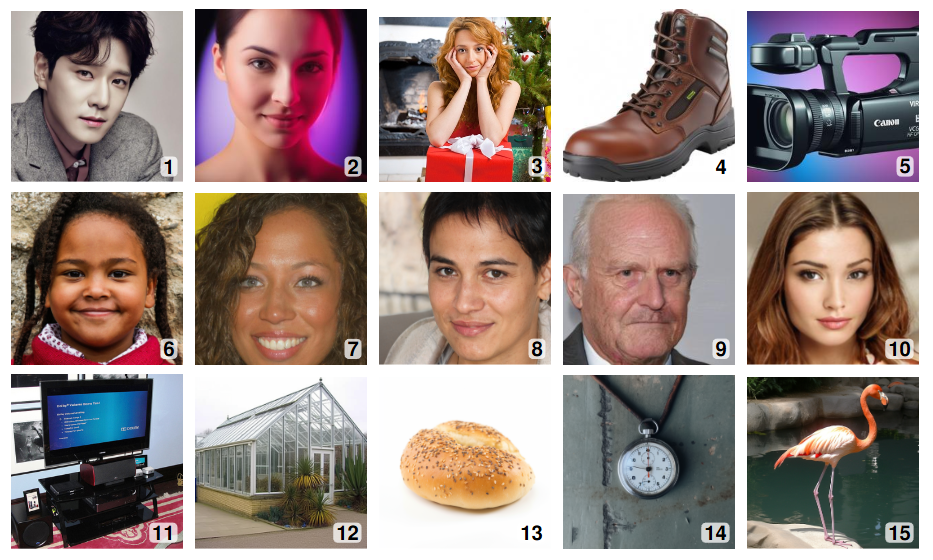

# `Zero-shot-s²`: Task-aligned prompting improves zero-shot detection of AI-generated images by Vision-Language Models

## Citation

If you use this code or these findings in your research, please cite:

```bibtex
@misc{kachwala2025taskalignedpromptingimproveszeroshot,
      title={Task-aligned prompting improves zero-shot detection of AI-generated images by Vision-Language Models}, 
      author={Zoher Kachwala and Danishjeet Singh and Danielle Yang and Filippo Menczer},
      year={2025},
      eprint={2506.11031},
      archivePrefix={arXiv},
      primaryClass={cs.LG},
      url={https://arxiv.org/abs/2506.11031}, 
}
```

## Overview

As image generators produce increasingly realistic images, concerns about potential misuse continue to grow. Traditional supervised detection methods rely on large, curated datasets and can struggle to generalize across diverse image generators. This repository accompanies the paper investigating the use of pre-trained Vision-Language Models (VLMs) for the zero-shot detection of AI-generated images.

While off-the-shelf VLMs exhibit some task-specific reasoning capabilities, and chain-of-thought prompting offers performance gains, we demonstrate that task-aligned prompting elicits more focused reasoning and significantly improves detection performance without requiring any model fine-tuning.

**The Core Method: `zero-shot-s²`**

The central method introduced in our work is `zero-shot-s²` (zero-shot style and synthesis).

> [!IMPORTANT]
> * **To apply our primary method for detecting AI-generated images:** This involves programmatically inserting the phrase **"Let's examine the style and the synthesis artifacts"** as a prefix into the VLM's *assistant* response field, guiding its generation process. This is the core of the `zero-shot-s²` technique. (The prompting logic, including this insertion, is managed by the `get_model_guiding_prefix_for_mode` function within `utils/helpers.py` in our experimental scripts). If your goal is to quickly leverage this core technique with a compatible open-source VLM, this is the main takeaway.
>
> * **To reproduce the full experimental results from our paper or to build extensively upon this work:** You will need to follow the detailed setup, data preparation (including downloading and organizing datasets), and experimental procedures outlined in the subsequent sections of this README.

### Applying the `zero-shot-s²` Prompt


> Illustration of three prompting strategies for zero-shot detection of AI-generated images using a VLM. Input text is marked in `grey`, response text in `blue`. (a) A standard user query `Is this image real or AI-generated?` results in the incorrect response `real`. (b) Inserting the chain-of-thought phrase `Let's think step by step` as a prefix to the response elicits reasoning, but the classification remains incorrect. (c) Inserting our proposed phrase `Let's examine the style and the synthesis artifacts` leads to the correct classification: `ai‑generated`.

Our study shows that the `zero-shot-s²` approach boosts Macro F1 scores by 8%–29% for two widely used open-source models. These gains are consistent across three recent, diverse datasets spanning human faces, objects, and animals, with images generated by 16 different models—demonstrating strong generalization.

We further evaluate the approach across three additional model sizes and observe improvements in most dataset–model combinations—suggesting robustness to model scale. Surprisingly, self-consistency, a behavior previously observed in language reasoning where aggregating answers from diverse reasoning paths improves performance, also holds in this visual reasoning setting. Even here, `zero-shot-s²` scales better with self-consistency than chain-of-thought in most cases—indicating that it elicits more useful diversity.

Our findings show that task-aligned prompts elicit more focused reasoning and enhance latent capabilities in VLMs, like the detection of AI-generated images—offering a simple, generalizable, and explainable alternative to supervised methods. This repository provides the code and experimental results to support these findings.

## Table of Contents

- [Repository Structure](#repository-structure)
- [Prerequisites](#prerequisites)
- [Setup](#setup)
  - [Quick Setup (Recommended)](#quick-setup-recommended)
  - [Manual Setup (Alternative)](#manual-setup-alternative)
- [Configuration](#configuration)
- [Usage](#usage)
  - [Running Experiments](#running-experiments)
    - [Example: Evaluating Qwen2.5 7B on GenImage (2k sample)](#example-evaluating-qwen25-7b-on-genimage-2k-sample)
    - [Example: Evaluating Qwen2.5 32B on D3 dataset](#example-evaluating-qwen25-32b-on-d3-dataset)
    - [Example: Evaluating CoDE model on GenImage (2k sample)](#example-evaluating-code-model-on-genimage-2k-sample)
  - [Generating Result Tables and Plots](#generating-result-tables-and-plots)
    - [Example: Generating Bootstrap Confidence Interval Plots](#example-generating-bootstrap-confidence-interval-plots)
    - [Example: Generating the Self-Consistency Scaling Analysis](#example-generating-the-self-consistency-scaling-analysis)
    - [Example: Linguistic Analysis of Reasoning Patterns](#example-linguistic-analysis-of-reasoning-patterns)
    - [Example: Generating the Self-Consistency Scaling Analysis](#example-generating-the-self-consistency-scaling-analysis)
  - [Downloading and Preprocessing D3 Dataset Images](#downloading-and-preprocessing-d3-dataset-images)
- [Expected Outputs](#expected-outputs)
- [Troubleshooting](#troubleshooting)
- [License](#license)

## Repository Structure

```
Zero-shot-s2/
├── config.py            # Central configuration for paths and global parameters
├── setup_environment.sh # Automated environment setup script
├── data/                # Placeholder for input datasets (managed via .gitignore)
│   ├── d3/              # D3 dataset images and metadata CSV
│   ├── df40/            # DF40 dataset CSVs and image subfolders
│   └── genimage/        # GenImage dataset CSVs and image subfolders
├── experiments/         # Scripts for running evaluations and data processing
│   ├── evaluate_AI_llama.py # Llama VLM evaluation (functional design)
│   ├── evaluate_AI_qwen.py  # Qwen VLM evaluation (functional design)
│   ├── evaluate_CoDE.py     # CoDE model evaluation
│   └── load_d3.py       # D3 dataset image downloader
├── outputs/             # Default location for generated results, plots, tables
│   ├── responses/       # Raw model responses and rationales (JSONL)
│   ├── scores/          # Evaluation scores (JSON, CSV)
│   ├── plots/           # Generated plots (PNG, PDF)
│   └── tables/          # Generated LaTeX tables (.tex)
├── results/             # Scripts for generating tables and plots from experiment outputs
│   ├── combine_tables.py      # Recall performance comparison tables
│   ├── distinct_words.py      # Linguistic analysis with log-odds ratios
│   ├── find_images.py         # Score pattern analysis across prompting methods
│   ├── macro_f1_bars.py       # Bootstrap confidence interval bar plots
│   ├── model_size_table.py    # Model scaling analysis tables
│   ├── prompt_table.py        # Prompting strategy comparison tables
│   ├── recall_subsets_table.py # Granular subset-level recall analysis
│   └── scaling_consistency.py # Self-consistency scaling analysis
├── utils/               # Utility scripts and shared helper functions
│   ├── helpers.py       # Core helper functions for data loading, evaluation, etc.
│   └── results_utils.py # Shared utilities for results processing
├── .gitignore           # Specifies intentionally untracked files (e.g., large data files)
├── LICENSE.md           # Project license
├── README.md            # This file
└── requirements.txt     # Python dependencies (for remaining packages after manual install of torch/flash-attn)
```

### **Code Architecture & Documentation**

This repository features a **clean, functional design** with comprehensive documentation:

- **✅ All 15 Python scripts** have detailed module and function docstrings
- **✅ Functional programming approach** - eliminated complex class hierarchies  
- **✅ Shared utility functions** - DRY principles with `helpers.py` and `results_utils.py`
- **✅ Consistent error handling** and logging throughout
- **✅ Statistical rigor** - bootstrap confidence intervals, proper significance testing
- **✅ Publication-ready outputs** - LaTeX tables, high-resolution plots

### **Key Features**

- **Zero-shot-s² Implementation**: Core task-aligned prompting via `helpers.get_model_guiding_prefix_for_mode()`
- **Multi-Model Support**: Qwen2.5 (3B, 7B, 32B, 72B), Llama 3.2 (11B, 90B), CoDE 
- **Statistical Analysis**: Bootstrap CIs, significance testing, scaling laws analysis
- **Linguistic Analysis**: Log-odds ratios for reasoning pattern identification
- **Academic Publishing**: Professional LaTeX tables and publication-ready visualizations

## Prerequisites

* Python (e.g., 3.10+ recommended)
* `pip` (Python package installer)
* (Optional) Conda for environment management
* (Optional but Recommended for speed) NVIDIA GPU with CUDA installed for model inference. This setup targets CUDA 12.6.

## Setup

### Quick Setup (Recommended)

We provide an automated setup script that handles the entire environment setup process:

```bash
git clone https://github.com/Zoher15/Zero-shot-s2.git
cd Zero-shot-s2
./setup_environment.sh
```

The script will:
1. Create a virtual environment (conda preferred, falls back to venv)
2. Create all required directory structures
3. Install PyTorch with CUDA 12.6 support
4. Install flash-attn (takes 10-15+ minutes to compile)
5. Install all remaining dependencies from requirements.txt
6. Download required NLTK data
7. Verify the installation

**Usage:**
- `./setup_environment.sh` - Full automated setup
- `./setup_environment.sh -h` - Show help and options
- `./setup_environment.sh --verify-only` - Verify existing installation

**Note:** If no virtual environment is detected, the script will create one and exit. You'll need to activate the environment and re-run the script:
```bash
# For conda (recommended)
conda activate zeroshot_s2
./setup_environment.sh

# For venv
source venv/bin/activate
./setup_environment.sh
```

### Manual Setup (Alternative)

If you prefer to set up the environment manually or need to customize the installation:

<details>
<summary>Click to expand manual setup instructions</summary>

#### 1. Clone the Repository

```bash
git clone https://github.com/Zoher15/Zero-shot-s2.git
cd Zero-shot-s2
```

#### 2. Create a Virtual Environment

It is highly recommended to use a virtual environment to manage dependencies.

**Using `conda` (Recommended for this project):**
```bash
conda create -n zeroshot_s2 python=3.10 -y
conda activate zeroshot_s2
```
(Note: The original README mentioned python=3.10.14; using python=3.10 is generally sufficient.)

**Using `venv`:**
```bash
python -m venv venv
source venv/bin/activate  # On Windows use: venv\Scripts\activate
```

#### 3. Install Dependencies

Due to the specific requirements of PyTorch with CUDA and `flash-attn`, dependencies must be installed in a particular order:

**a. Install PyTorch, Torchvision, and Torchaudio:**
These packages need to be installed explicitly with CUDA 12.6 support from the specified PyTorch index.
```bash
pip install --no-cache-dir "torch==2.7.0+cu126" "torchvision==0.22.0+cu126" "torchaudio==2.7.0+cu126" --extra-index-url https://download.pytorch.org/whl/test/cu126
```

**b. Verify PyTorch Installation:**
After the previous step completes, verify that PyTorch is installed correctly and can access CUDA:
```bash
python -c "import torch; print(f'PyTorch version: {torch.__version__}'); print(f'CUDA available: {torch.cuda.is_available()}'); print(f'CUDA version used by PyTorch: {torch.version.cuda if torch.cuda.is_available() else None}'); print(f'cuDNN version: {torch.backends.cudnn.version() if torch.cuda.is_available() else None}')"
```
This command should output the PyTorch version (e.g., `2.7.0+cu126`), confirm CUDA is available (`True`), and show relevant CUDA/cuDNN versions. If not, troubleshoot the PyTorch installation before proceeding.

**c. Install `flash-attn`:**
With PyTorch correctly installed, `flash-attn` can now be installed. We use `ninja` for parallel compilation, which can speed up the process. Please be aware that this step might take a considerable amount of time (potentially up to 16 minutes or more, depending on your system).
```bash
pip install packaging
pip install ninja
pip install flash-attn --no-build-isolation --no-cache-dir
```

**d. Install Remaining Dependencies:**
The rest of the dependencies are listed in `requirements.txt`. Install them using:
```bash
pip install -r requirements.txt --no-cache-dir
```

**e. Create Directory Structure:**
```bash
mkdir -p data/{d3,df40,genimage}
mkdir -p outputs/{responses,scores,plots,tables}
mkdir -p cache logs
```

**f. Download NLTK Data:**
```bash
python -c "import nltk; nltk.download('wordnet'); nltk.download('stopwords'); nltk.download('punkt')"
```

*(Note: Some scripts, e.g., in `results/`, may require NLTK resources like WordNet, stopwords, and punkt. Utilities within the project, such as `utils/helpers.py` or specific scripts like `results/distinct_words.py`, attempt to download these automatically if they are missing. See Troubleshooting for NLTK `LookupError` if issues arise.)*

</details>

### Data Preparation

This project requires several datasets. Due to their size, they are not included directly in the repository. You need to download them and organize them according to the structure defined in `config.py`. By default, scripts expect datasets to be in the `Zero-shot-s2/data/` directory.

The original sources for the datasets are:

  * **D3 (and CoDE)**: [https://github.com/aimagelab/CoDE](https://github.com/aimagelab/CoDE)
  * **GenImage**: [https://github.com/GenImage-Dataset/GenImage](https://github.com/GenImage-Dataset/GenImage)
  * **DF40**: [https://github.com/YZY-stack/DF40](https://github.com/YZY-stack/DF40)


> A sample of images from the D3 (top), DF40 (middle), and GenImage (bottom) datasets. Can you guess which ones are real vs AI-generated? The answer is in the footnote on page 2 of the paper.

The expected structure within `data/` after preparation is:

```
Zero-shot-s2/
└── data/
    ├── d3/
    │   └── 2k_sample_ids_d3.csv # CSV for D3 image IDs
    │   └── (images will be saved here by load_d3.py)
    ├── df40/
    │   ├── 10k_sample_df40.csv
    │   └── 2k_sample_df40.csv
    │   └── Collabdiff/
    │   │   └── ... images ...
    │   └── MidJourney/
    │   │   └── ... images ...
    │   └── stargan/
    │   │   └── ... images ...
    │   └── starganv2/
    │   │   └── ... images ...
    │   └── styleclip/
    │   │   └── ... images ...
    │   └── whichfaceisreal/
    │       └── ... images ...
    └── genimage/
        ├── 10k_random_sample.csv
        └── 2k_random_sample.csv
        └── ADM/
        │   └── ... images ...
        └── BigGAN/
        │   └── ... images ...
        └── ... etc. for all generators ...
```

  * **D3 Dataset**: ([Original source](https://github.com/aimagelab/CoDE))

      * **Image Files**: The D3 dataset images are downloaded using a script.
          * The script `experiments/load_d3.py` will download and save images based on an ID CSV file.
      * **CSV File**: By default, `config.py` is set up to use `data/d3/2k_sample_ids_d3.csv` (defined in `config.D3_CSV_FILE`). Ensure this file exists at this location or update `config.py`. The CSV file must contain a column named 'id'.

  * **DF40 Dataset**: ([Original source](https://github.com/YZY-stack/DF40))

      * **Image Files**:
          * Download the required .zip files from the [Google Drive link](https://drive.google.com/drive/folders/1980LCMAutfWvV6zvdxhoeIa67TmzKLQ_)
          * You only need to download and unzip the archives for the following generators: `Collabdiff`, `MidJourney`, `stargan`, `starganv2`, `styleclip`, and `whichfaceisreal`. These were chosen because they include real image counterparts.
          * For each downloaded .zip file (e.g., `Collabdiff.zip`), extract its contents into the `Zero-shot-s2/data/df40/` directory. This will typically create a subdirectory named after the archive (e.g., `Zero-shot-s2/data/df40/Collabdiff/`).
            ```bash
            # Example:
            # cd path/to/Zero-shot-s2/data/df40/
            # unzip Collabdiff.zip
            # unzip MidJourney.zip
            # ... and so on for the specified folders.
            ```
          * Ensure the extracted image folders are located directly within `Zero-shot-s2/data/df40/`.
      * **CSV Files**: Ensure the respective CSV files (`10k_sample_df40.csv`, `2k_sample_df40.csv`) are in the `Zero-shot-s2/data/df40/` directory. The specific filenames for CSVs are defined in `config.py` (e.g., `config.DF40_2K_CSV_FILE`). The image paths within these CSVs should be relative to the `data/df40/` directory (e.g., `Collabdiff/image_001.png`, `whichfaceisreal/real/abc.png`) or be absolute paths that your system can access, corresponding to the extracted image locations.

  * **GenImage Dataset**: ([Original source](https://github.com/GenImage-Dataset/GenImage))

      * **Image Files**:
          * Download all image archives from the following [Google Drive link](https://drive.google.com/drive/folders/1jGt10bwTbhEZuGXLyvrCuxOI0cBqQ1FS).
          * The Drive folder contains subfolders for each generator (ADM, BigGAN, glide, Midjourney, stable\_diffusion\_v\_1\_4, stable\_diffusion\_v\_1\_5, VQDM, wukong). Inside each, you will find multipart zip files (e.g., `imagenet_ai_0508_adm.zip`, `imagenet_ai_0508_adm.z01`, `imagenet_ai_0508_adm.z02`).
          * Download these multipart zip files for each generator you intend to use.
          * You need to extract these images into the `Zero-shot-s2/data/genimage/` directory, creating subdirectories for each generator.
          * Use a tool like 7-Zip to extract the multipart archives. For example, to extract images for the ADM generator, ensure all its parts (e.g., `imagenet_ai_0508_adm.z01`, `imagenet_ai_0508_adm.z02`, etc.) are in the same temporary directory. Then, run the extraction command on the `.zip` file:
            ```bash
            # Example for ADM:
            # cd /path/to/downloaded_adm_parts/
            # 7z x imagenet_ai_0508_adm.zip -o /path/to/Zero-shot-s2/data/genimage/ADM
            ```
            This command tells 7-Zip to extract `imagenet_ai_0508_adm.zip` and it will automatically find the other parts as long as they're in the same directory. The `-o` flag specifies the output directory, creating an `ADM` subfolder inside `Zero-shot-s2/data/genimage/`. Repeat for all generator folders, adjusting the output path accordingly (e.g., `-o /path/to/Zero-shot-s2/data/genimage/BigGAN`).
          * The final structure should result in folders like `Zero-shot-s2/data/genimage/ADM/`, `Zero-shot-s2/data/genimage/BigGAN/`, etc., each containing the respective images.
      * **CSV Files**: Ensure the respective CSV files (`10k_random_sample.csv`, `2k_random_sample.csv`) are in the `Zero-shot-s2/data/genimage/` directory. The specific filenames for CSVs are defined in `config.py` (e.g., `config.GENIMAGE_2K_CSV_FILE`). The image paths within these CSVs should be relative to the `data/genimage/` directory (e.g., `ADM/image1.png`) or be absolute paths that your system can access, corresponding to the extracted image locations.

  * **Large Data Files**: Large data files and directories within `data/` (like image folders) should be added to your local `.gitignore` file if they are not already, to prevent accidental versioning. The provided `.gitignore` may already cover common patterns.

*(For detailed information on dataset contents and structure, please refer to their original repositories linked above.)*

## Configuration

This project uses a central `config.py` file located at the root of the repository to manage all important paths and global parameters.

  * **Paths**: All input data paths (e.g., `config.DATA_DIR`, `config.D3_CSV_FILE`), output paths (`config.OUTPUTS_DIR`, `config.RESPONSES_DIR`, `config.PLOTS_DIR`), and cache paths (`config.CACHE_DIR`) are defined here.
  * **Parameters**: Some global evaluation parameters, like `config.EVAL_QUESTION_PHRASE`, are also set in `config.py`.

If you organize your data differently or want to change output locations, you should primarily modify the relevant path variables in `config.py`. There should be no need to change hardcoded paths within individual scripts.

## Usage

All scripts should be run from the root directory of the repository (`Zero-shot-s2/`).

### Running Experiments

The `experiments/` directory contains scripts to run evaluations on different models and datasets. These scripts use a **clean functional design** with shared utilities in `helpers.py` for argument parsing, data loading, and result saving.

**Example: Evaluating Qwen2.5 7B on the GenImage dataset (2k sample)**

```bash
python experiments/evaluate_AI_qwen.py \
    -llm qwen25-7b \
    -c 0 \
    -d genimage2k \
    -b 20 \
    -n 1 \
    -m zeroshot-2-artifacts
```

**Example: Evaluating Qwen2.5 32B on D3 dataset**

```bash
python experiments/evaluate_AI_qwen.py \
    -llm qwen25-32b \
    -c 0 \
    -d d32k \
    -b 10 \
    -n 1 \
    -m zeroshot-2-artifacts
```

**Example: Evaluating CoDE model on the GenImage dataset (2k sample)**

The CoDE model is a traditional computer vision approach and has a different evaluation mechanism.
It does not use prompting modes (`-m`) or number of sequences (`-n`) in the same way as VLMs.

```bash
python experiments/evaluate_CoDE.py \
    -c 0 \
    -d genimage2k \
    -b 50
```

**Supported Models:**

- **Qwen2.5 VLMs**: `qwen25-3b`, `qwen25-7b`, `qwen25-32b`, `qwen25-72b`
- **Llama 3.2 VLMs**: `llama3-11b`, `llama3-90b` 
- **Traditional CV**: `CoDE` (trained on D3)

**Common Arguments for Evaluation Scripts:**

  * `-llm` or `--llm`: Model identifier. Refer to the model dictionaries within each evaluation script for available models.
  * `-c` or `--cuda`: CUDA device ID(s) (e.g., `0`, or `0,1` for multiple GPUs).
  * `-d` or `--dataset`: Dataset identifier (e.g., `genimage`, `genimage2k`, `d3`, `d32k`, `df40`, `df402k`).
  * `-b` or `--batch_size`: Batch size for model inference.
  * `-n` or `--num`: Number of sequences to generate for self-consistency evaluation.
  * `-m` or `--mode`: Prompting strategy:
    - `zeroshot`: Direct classification
    - `zeroshot-cot`: Chain-of-thought reasoning  
    - `zeroshot-2-artifacts`: **Zero-shot-s²** (our primary method)

Refer to the comprehensive docstrings in each script and `helpers.get_evaluation_args_parser()` for complete argument details.

### GPU Memory Management

The evaluation scripts implement **optimized GPU memory management** to prevent conflicts and ensure efficient resource utilization:

**🔧 CUDA Device Setup:**
- CUDA environment (`CUDA_VISIBLE_DEVICES`) is set **before** PyTorch initialization
- This prevents PyTorch from allocating memory on all available GPUs
- Ensures deterministic device assignment and avoids "CUDA out of memory" conflicts

**💡 Best Practices:**
```bash
# Single GPU usage (recommended for large models)
python experiments/evaluate_AI_qwen.py -c 0 -llm qwen25-32b

# Multi-GPU setup (if needed)
python experiments/evaluate_AI_qwen.py -c 0,1 -llm qwen25-72b

# Specify non-default GPU to avoid conflicts
python experiments/evaluate_AI_qwen.py -c 3 -llm qwen25-7b
```

**⚡ Memory Optimization Features:**
- Automatic GPU cache clearing between batches
- Expandable memory segments (`PYTORCH_CUDA_ALLOC_CONF=expandable_segments:True`)
- Model compilation for improved inference speed
- Batch size optimization for memory-constrained environments

### Generating Result Tables and Plots

The `results/` directory contains **comprehensively documented scripts** to process experiment outputs and generate publication-ready tables and plots with **statistical rigor**. All scripts feature detailed docstrings explaining methodology, statistical approaches, and usage.

**Key Results Scripts:**

- **`macro_f1_bars.py`**: Bootstrap confidence interval bar plots for robust statistical comparison
- **`scaling_consistency.py`**: Self-consistency scaling analysis with trend visualization  
- **`distinct_words.py`**: Linguistic analysis using log-odds ratios to identify reasoning patterns
- **`model_size_table.py`**: Model scaling analysis across parameter counts
- **`prompt_table.py`**: Comprehensive prompting strategy comparison tables
- **`recall_subsets_table.py`**: Granular subset-level performance analysis
- **`combine_tables.py`**: Multi-model recall performance comparison

**Example: Generating Bootstrap Confidence Interval Plots**

```bash
python results/macro_f1_bars.py
```

This generates publication-ready bar plots with 95% confidence intervals using 1000 bootstrap iterations, saved to `outputs/plots/`.

**Example: Generating the Self-Consistency Scaling Analysis**

```bash
python results/scaling_consistency.py
```

This creates scaling trend plots showing how performance improves with multiple reasoning samples.

**Example: Linguistic Analysis of Reasoning Patterns**

```bash
python results/distinct_words.py
```

This performs log-odds ratio analysis to identify distinctive vocabulary across prompting methods.

**Statistical Features:**
- **Bootstrap confidence intervals** (1000 iterations) for robust uncertainty quantification
- **Significance testing** with proper multiple comparison corrections
- **Publication-ready formatting** with LaTeX tables and high-resolution plots
- **Automatic caching** of computationally intensive bootstrap results
- **Professional visualization** with colorblind-friendly palettes

All results scripts include comprehensive error handling and detailed logging for reproducibility.

### Downloading and Preprocessing D3 Dataset Images

The `experiments/load_d3.py` script is used to download and save images for the D3 dataset based on a CSV file containing image IDs.

```bash
python experiments/load_d3.py
```

The script uses default paths for the CSV file (`config.D3_CSV_FILE`) and save directory (`config.D3_DIR`) as defined in `config.py`. If your files are located elsewhere, or if you are using a different CSV file, you can specify them using command-line arguments:

```bash
python experiments/load_d3.py \
    --ids_csv_filepath path/to/your/d3_ids.csv \
    --id_column_name your_id_column \
    --save_directory path/to/your/d3_images_save_location \
    --timeout 15 \
    --force    # Optional: to overwrite existing images
    --verbose  # Optional: for debug logging
```

A log file (`load_d3_processing.log` by default, path configured by `config.LOAD_D3_LOG_FILE`) will be created in the project root.

## Expected Outputs

  * **Experiment Scripts (`experiments/evaluate_AI_*.py`, `experiments/evaluate_CoDE.py`)**:
      * **Rationale files** (JSONL format) in `config.RESPONSES_DIR` containing detailed model reasoning 
      * **Score files** (JSON for confusion matrices, CSV for Macro F1 scores) in `config.SCORES_DIR`
      * **Comprehensive logging** with detailed progress tracking and error reporting
      
  * **Result Scripts (`results/*.py`)**:
      * **High-resolution plots** (.png) in `config.PLOTS_DIR` with publication-ready formatting
      * **Professional LaTeX tables** (.tex) in `config.TABLES_DIR` with proper academic styling
      * **Bootstrap analysis results** with cached confidence intervals for efficient re-analysis
      * **Statistical summaries** printed to console with detailed methodology explanations
      * **Linguistic analysis outputs** including word clouds and distinctiveness metrics
      
  * **Data Loading Scripts (`experiments/load_d3.py`)**:
      * **Downloaded images** organized in the specified save directory (e.g., `data/d3/`)
      * **Detailed processing logs** documenting download success/failure rates
      
  * **Enhanced Features**:
      * **Bootstrap confidence intervals** (95% CI, 1000 iterations) for statistical robustness
      * **Publication-ready visualizations** with colorblind-friendly palettes
      * **Comprehensive documentation** with detailed docstrings explaining methodology
      * **Automatic error handling** with informative error messages and recovery suggestions
      * **Performance caching** for computationally intensive statistical analyses

## Troubleshooting

  * **Environment Setup Issues**:
      * Try using the automated setup script: `./setup_environment.sh`
      * To verify an existing installation: `./setup_environment.sh --verify-only`
      * For help with the setup script: `./setup_environment.sh -h`
  * **`FileNotFoundError`**:
      * Ensure that all required dataset files (CSVs, image directories) are correctly placed as per the "Data Preparation" section and that paths in `config.py` point to them correctly. Pay attention to directory and file casing, especially on case-sensitive systems like Linux.
      * Verify that output directories specified in `config.py` are writable.
      * The setup script automatically creates required directories; run `./setup_environment.sh` if directories are missing.
  * **`ModuleNotFoundError`**:
      * Make sure your virtual environment is activated.
      * Try running the setup script: `./setup_environment.sh` (it will verify the environment and install missing dependencies).
      * Verify that all dependencies from `requirements.txt` have been installed correctly (`pip install -r requirements.txt`).
      * Ensure you are running scripts from the project's root directory (`Zero-shot-s2/`).
  * **CUDA Errors / GPU Issues**:
      * Run `./setup_environment.sh --verify-only` to check your CUDA and PyTorch installation.
      * Ensure PyTorch is installed with the correct CUDA version matching your system's CUDA drivers and GPU architecture.
      * **GPU Memory Management**: The scripts now automatically set `CUDA_VISIBLE_DEVICES` before PyTorch initialization to prevent memory conflicts.
      * **Memory Conflicts**: If you encounter "CUDA out of memory" errors:
        - Use `-c` argument to specify specific GPU(s): `python experiments/evaluate_AI_qwen.py -c 1`
        - Reduce batch size with `-b` argument: `python experiments/evaluate_AI_qwen.py -b 10`
        - Ensure no other processes are using the GPU: `nvidia-smi`
      * **Device Selection**: Verify GPU availability and selection:
        ```bash
        python -c "import torch; print(f'CUDA available: {torch.cuda.is_available()}'); print(f'Device count: {torch.cuda.device_count()}'); print(f'Current device: {torch.cuda.current_device() if torch.cuda.is_available() else \"None\"}')"
        ```
      * **Multi-GPU Setup**: For multi-GPU usage, specify comma-separated device IDs: `-c 0,1,2`
  * **NLTK `LookupError`**:
      * The setup script automatically downloads NLTK data. If you encounter issues, re-run: `./setup_environment.sh`
      * Alternatively, manually download NLTK resources:
        ```bash
        python -c "import nltk; nltk.download('wordnet'); nltk.download('stopwords'); nltk.download('punkt')"
        ```
  * **flash-attn Installation Issues**:
      * The setup script handles flash-attn compilation automatically. If you encounter issues:
        * Ensure you have sufficient disk space and memory for compilation
        * Try running the setup script again: `./setup_environment.sh`
        * For manual installation, refer to the manual setup instructions in the collapsed section above
  * **Incorrect File Paths in Scripts**:
      * This should be minimal if `config.py` is used correctly. If you suspect a path issue within a script, verify it's using a variable from `config.py` rather than a hardcoded path.

## License

This project is licensed under the MIT License - see the [`LICENSE.md`](LICENSE.md) file for details.
